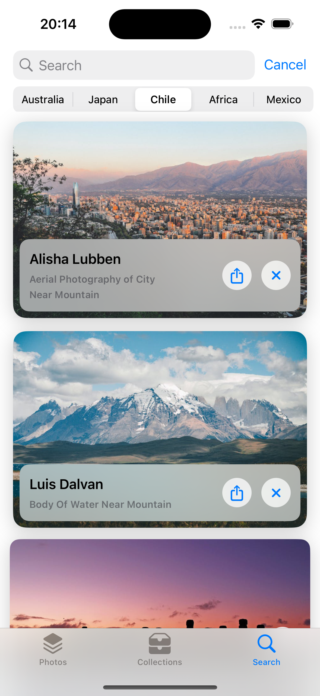

## pexels-api-swiftui-mvvm
An iOS app built using SwiftUI with MVVM architecture. It uses Pexels API to fetch the images.

------------

### Features
- View high-quality photos from the Pixels API
- Smooth and intuitive user interface built with SwiftUI & MVVM
- Search functionality to discover photos based on keywords

### Project setup
- You need to setup the `PEXELS_API_KEY` value in `Pexels-API-SwiftUI/Util/Constant.swift`
- Get your own API key from [Pexels API](https://www.pexels.com/api/)

   

